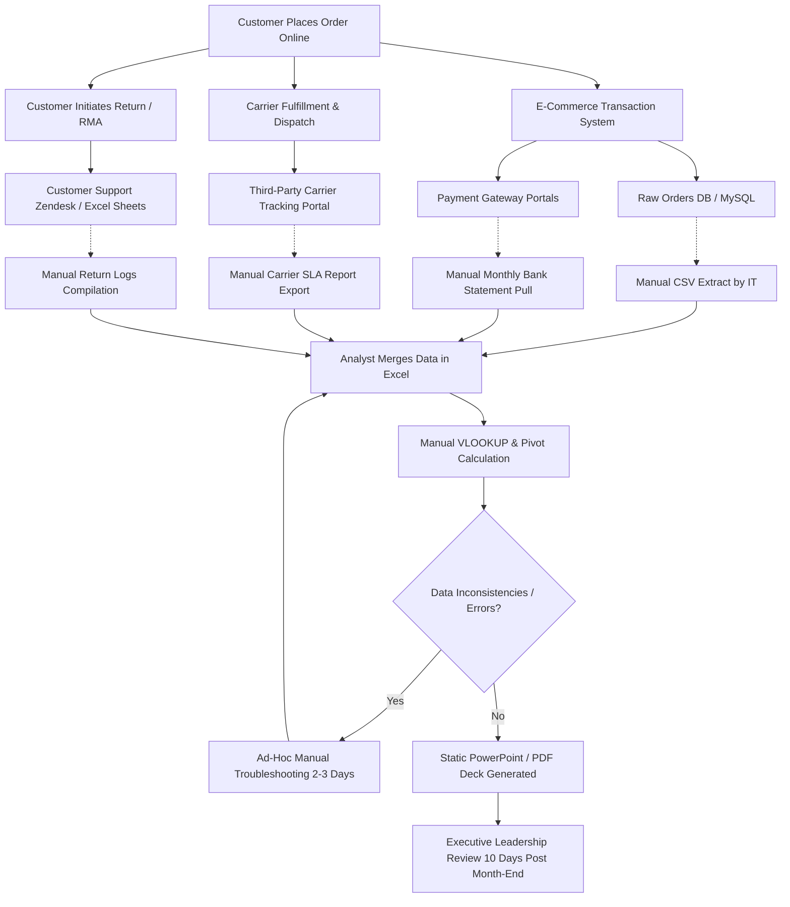

# ShopSphere As-Is Process Documentation (Current State)

## 1. Process Overview & Context
Prior to the implementation of the centralized Business Intelligence solution, ShopSphere operates on an ad-hoc, highly manual, and siloed reporting workflow. Data is fragmented across relational transaction logs, external carrier tracking portals, customer support spreadsheets, and accounting ledgers.

---

## 2. As-Is Process Flowchart (Mermaid Architecture)

---

## 3. Step-by-Step Current Process Breakdown

| Step # | Process Activity | Performing Role | Systems / Tools Involved | Estimated Duration | Primary Failure Modes |
|---|---|---|---|---|---|
| **1** | **Order Placement & Recording** | Customer / System | Checkout Web Server & MySQL DB | Real-time | Occasional duplicate records during network timeouts. |
| **2** | **Carrier Dispatch & Tracking** | 3PL Carrier Partner | External Carrier API / Web Portals | 1–7 Days | Status discrepancies between internal ERP and carrier portals. |
| **3** | **Return Processing** | Support Agent | Customer Support Desk & Manual Sheet | 3–21 Days | Return reason codes free-typed with inconsistent spelling. |
| **4** | **Data Extraction** | Database Admin | SQL Dumps / CSV Exports | 1–2 Days | IT bottlenecks, delayed query turnaround, schema drift. |
| **5** | **Spreadsheet Consolidation** | Junior Data Analyst | Microsoft Excel | 2–3 Days | VLOOKUP formula errors, row limit crashes, duplicate keys. |
| **6** | **Manual Metric Calculation** | Finance / Business Analyst | Excel Formulas & Pivot Tables | 1–2 Days | Conflicting definitions of "Net Revenue" and "Margin %". |
| **7** | **Presentation Deck Creation** | Department Leads | PowerPoint / PDF Slides | 2 Days | Static screenshots, zero interactivity, outdated upon review. |
| **8** | **Management Review** | C-Suite / Executives | Monthly Review Meeting | 10 Days Post Close | Inability to drill down to SKU or root causes during meeting. |

---

## 4. Critical Pain Points & Operational Bottlenecks

### 4.1 Extreme Reporting Latency
- Executive leadership does not receive monthly performance reviews until **8 to 10 business days after the close of the month**.
- In an agile e-commerce environment, a 10-day delay means promotional overspending or carrier fulfillment breakdowns continue uncorrected for weeks.

### 4.2 High Manual Overhead & Redundant Labor
- Analysts spend **over 65% of their working hours manually downloading, copying, cleaning, and stitching CSV files** in Excel rather than performing forward-looking strategic analysis.

### 4.3 Data Inconsistency & Formula Fragility
- Different departments compute core metrics using conflicting logic (e.g. Sales reports Gross Revenue before returns, while Finance reports Net Revenue after discount allowances).
- Complex VLOOKUP formulas break easily when new product SKUs or regional codes are introduced.

### 4.4 Inability to Perform Interactive Drill-Downs
- Executive decks consist of static PDF slides. When leadership asks: *"Why did West region margins compress in November?"*, analysts cannot drill down live and must table the question for a follow-up meeting days later.

### 4.5 Blindness to Operational Root Causes
- Delivery latency and reverse logistics returns are tracked in completely separate departmental silos. As a result, the commercial impact of carrier delays on return rates remained completely hidden.
