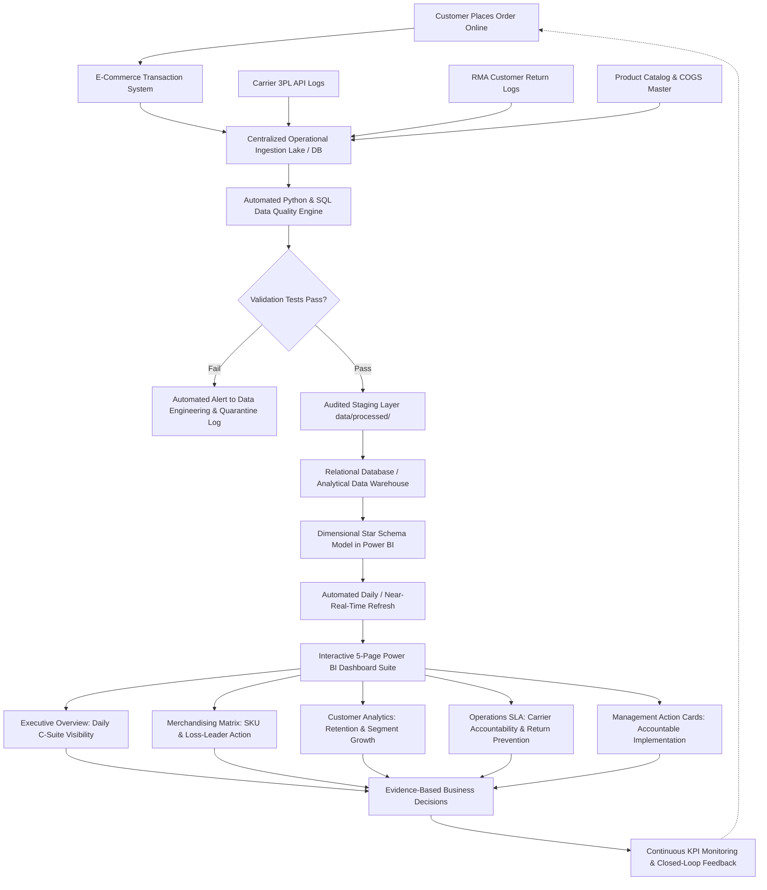

# ShopSphere To-Be Process Documentation (Future State)

## 1. Future State Vision & Architecture
The To-Be analytical architecture replaces manual spreadsheet stitching with an automated, governed, single-source-of-truth Business Intelligence data pipeline. Data is extracted directly from operational endpoints, staged in an audited relational repository, processed via deterministic Python and SQL transformations, and modeled into an enterprise Star Schema in Power BI.

---

## 2. To-Be Process Flowchart (Mermaid Architecture)

---

## 3. Step-by-Step Future State Process Breakdown

| Step # | Process Phase | System / Engine | Automated Mechanism | Execution Frequency | Expected SLA |
|---|---|---|---|---|---|
| **1** | **Operational Data Capture** | Source Systems (Orders, Delivery, Returns) | Webhooks / Batch DB Replication | Daily / Continuous | Automated |
| **2** | **Automated Data Quality Audit** | Python Script (`clean_and_profile.py`) | 13 Programmatic Integrity & Boundary Checks | Scheduled Batch | < 30 Seconds |
| **3** | **Relational Ingestion & Staging** | Enterprise Warehouse / SQLite DB | ANSI SQL Ingestion Scripts (`schema.sql`) | Post-Audit | < 1 Minute |
| **4** | **Dimensional Modeling** | Power BI VertiPaq Engine | Star Schema (`FactOrders`, Conformed Dimensions) | Daily Auto-Refresh | < 2 Minutes |
| **5** | **DAX KPI Calculation** | Centralized DAX Measures Library | Single Source of Truth Formulas | On-Demand Dynamic | Sub-Second |
| **6** | **Self-Service Dashboard Access** | Power BI Service (Web / Mobile) | Role-Based Access Control (RBAC) | 24/7 On-Demand | Real-Time |
| **7** | **Operational Action Execution** | Departmental Leadership | Management Insights Decision Matrix | Weekly Cadence | Continuous |
| **8** | **Closed-Loop KPI Monitoring** | Executive Scorecard | Automated Alerting & Variance Tracking | Continuous | Immediate |

---

## 4. Key Process Improvements & Value Realization

### 4.1 95% Reduction in Reporting Latency
- Elimination of manual Excel stitching reduces executive reporting cycle time from **10 business days post month-end to under 5 minutes** following automated data refresh.

### 4.2 Single Source of Truth (SSOT) Governance
- Elimination of competing departmental calculations. A centralized DAX measures dictionary guarantees that `Net Revenue`, `Gross Margin %`, `Return Rate`, and `AOV` match identically across Executive, Sales, Finance, and Operations reports.

### 4.3 Interactive Dynamic Self-Service
- C-suite and department heads can slice data dynamically across 36 months, 5 sales territories, 5 product departments, and 3 customer segments with sub-second visual responsiveness.

### 4.4 Proactive Operational Intervention
- Real-time cross-filtering between delivery tracking and reverse logistics empowers Operations to identify carrier SLA failures early, renegotiate 3PL agreements, and proactively contact delayed customers before returns are initiated.

### 4.5 Quantified Financial Protection
- Continuous loss-leader flagging protects enterprise margins by highlighting heavily subsidized promotional SKUs before significant capital is burned.
